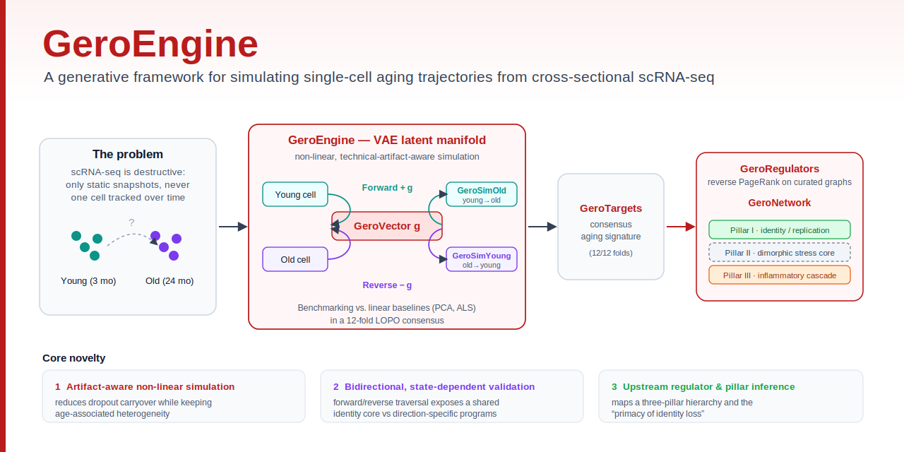
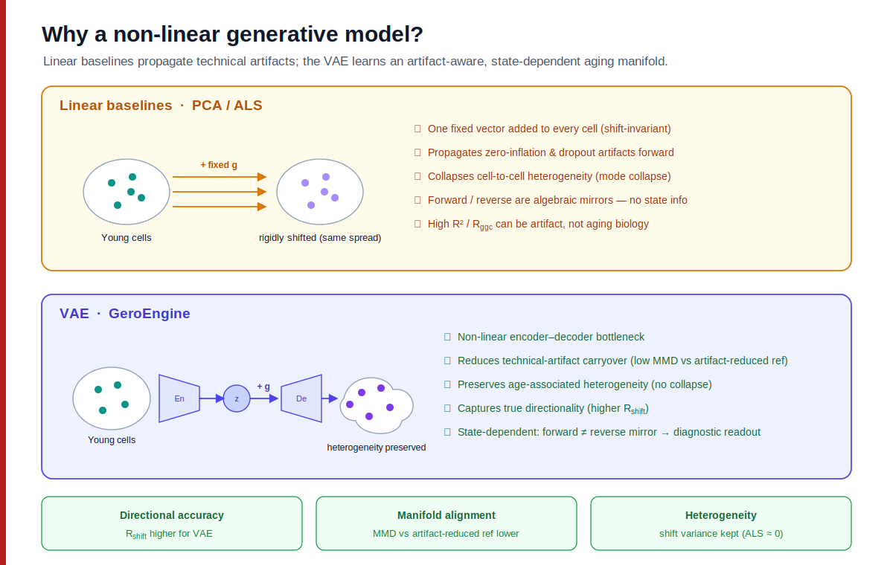
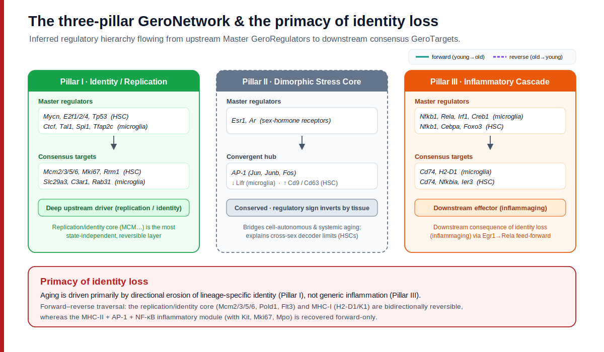

<div align="center">
  

# GeroEngine: Generative single-cell aging trajectories reveal a bidirectionally traversable identity core and direction-specific inflammatory remodeling

[Youngmin Bhak](https://scholar.google.com/citations?user=H3pKrzYAAAAJ)<sup>1,2</sup>, [Sungwon Jeon](https://scholar.google.com/citations?user=9o-0nIQAAAAJ)<sup>3</sup>, [Jong Bhak](https://scholar.google.com/citations?user=ZUBVdMAAAAAJ)<sup>1,3,*</sup>  

<sup>1</sup> [Department of Biomedical Engineering](https://bme.unist.ac.kr/eng/), College of Information and Biotechnology, [Ulsan National Institute of Science and Technology (UNIST)](https://www.unist.ac.kr/unist/index.do), Ulsan, Republic of Korea  
<sup>2</sup> [Spidercore Inc](https://www.spidercore.io/), Daejeon, Republic of Korea  
<sup>3</sup> [AgingLab](https://aginglab.com/), Ulsan National Institute of Science and Technology (UNIST), Ulsan, Republic of Korea  

<sup>*</sup> Corresponding author: [jongbhak@gmail.com](mailto:jongbhak@gmail.com)
</div>

---


## Why a non-linear model

## The three-pillar model


# Construct conda environment
```bash
conda env create -f ./GeroEngine_environment.yml -n py39_geroengine
```

# Data preparation
```bash
./data/tabula-muris-senis-facs-official-raw-obj.h5ad
```

# 1. Select HVGs
```bash
bash 01_select_hvgs.sh
Output: ./aging_simulation_model_gene_selection
```

# 2. Select Hyperparameters
```bash
02_1_search_hyperparameters.sh
Output: ./aging_simulation_model_gene_selection

02_2_plot_searched_hyperparameters.sh
Output: ./aging_simulation_hyperparameter_search_aggregation_and_plot
```

# 3. Train Model
```bash
bash 03_train_gerosimulator.sh
Output: ./aging_simulation_model
```

# 4. Download Trained Model

# 5. Run Inference
```bash
bash 05_1_inference_forward_simulation.sh
Output: ./aging_simulation_model_inference_main

bash 05_2_inference_forward_simulation_ood_age.sh
Output: ./aging_simulation_model_inference_OOD_18_male

bash 05_3_inference_forward_simulation_ood_age_and_sex.sh
Output: ./aging_simulation_model_inference_OOD_18_female

bash 05_4_inference_reverse_simulation.sh
Output: ./aging_simulation_model_inference_main_rejuvenation
```

# 6. Find GeroTargets
```bash
bash 06_find_gerotarget.sh
Output: ./concensus_genes_for_master_regulator
```

# 7. Perform GSEA on GeroTargets
```bash
bash 07_gsea.sh
Output: ./gsea
```

# 8. Find GeroRegulators
```bash
bash 08_1_construct_network_database.sh 
Output: ./gene_network_construction

bash 08_2_find_regulators_by_ppr.sh 
Output: ./master_regulator

bash 08_3_regulator_filtering_by_kneedle_algorithm.sh
Output: ./master_regulator_filtering

bash 08_4_regulator_filtering_by_topological_score_and_min_target.sh
Output: ./master_regulator_filtering2
```

# 9. Construct GeroNetwork Data
```bash
bash 09_1_construct_paths_of_targets_and_regulators.sh
Output: ./master_regulator_to_aging_gene_paths

bash 09_2_construct_final_network_data.sh
Output: ./unify_data_for_integrated_network
```

# 10. Generate Figures
```bash
bash 10_1_figure_metrics.sh
Output: ./figure_generator

bash 10_2_run_merge_all_LOPO_LFC.sh
Output: ./merge_all_LOPO_LFC

bash 10_3_figure_forward_reverse_gerotarget_overlap.sh
Output: ./figure_generator_bidirectional
```